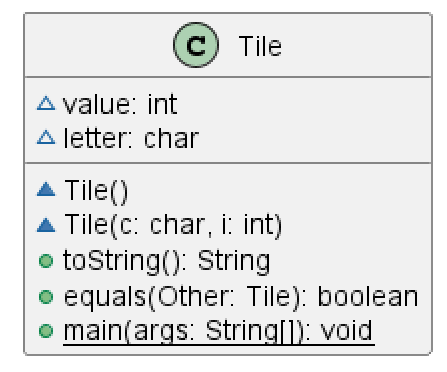
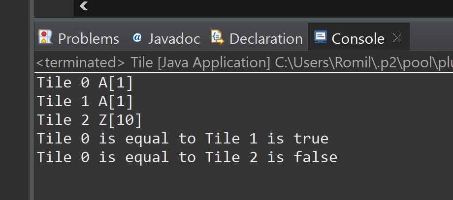

# Tile report
Author: Romil Dhagat 

## UML class diagram

## Specification
The class of Tile represents a scrabble board tile piece identified by a character and value, and it allows you to return a string that describes the tile and check if the tiles are equal to each other

## Execution and Testing

# Reflection
I have some experience with coding in Java so I found this assignment easy however I had not used markdown files before and so learning how to use markdown files was interesting. I also had never used PlantUML to create UML diagrams and so that was something I had to get used to. I appreciate learning these new methods to help my java code be understood better. 