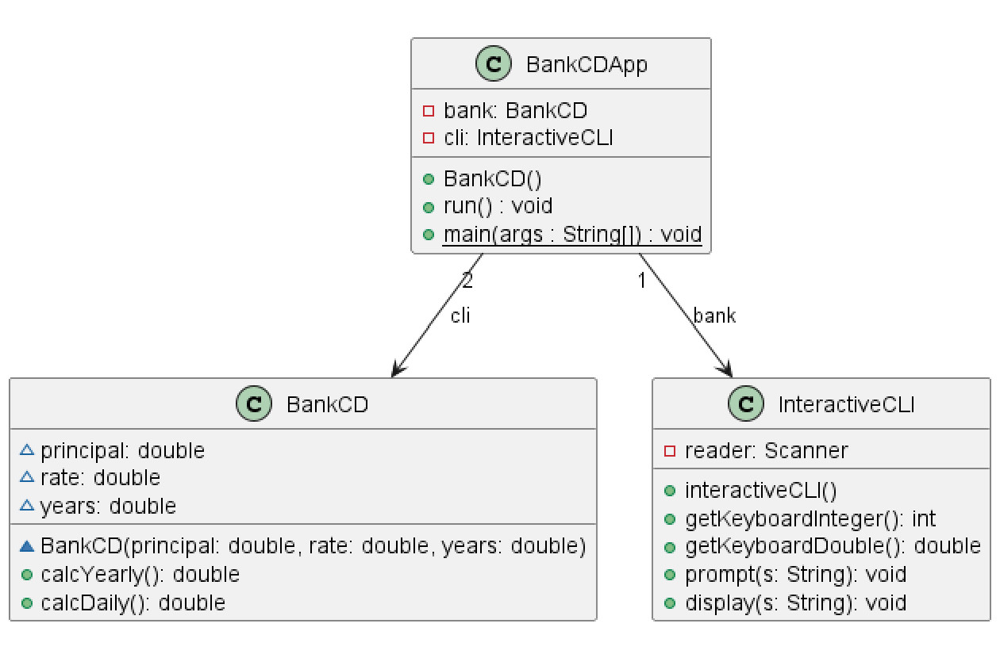
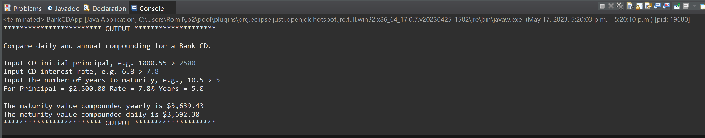

# Days in Month report
Author: Romil Dhagat

## UML class diagram

## Execution and Testing

# Reflection
I have not designed graphical user interfaces before, therefore I was challanged by that and learned how to use it and did my own research on the syntax for it. I also liked the BankCD aspect of the assignment as it was challanging and the numberFormatter is something new to me. It was good to see that I didn't need to use String.Format to do that formatting every time. Overall I had a good time and challange with this assignment.