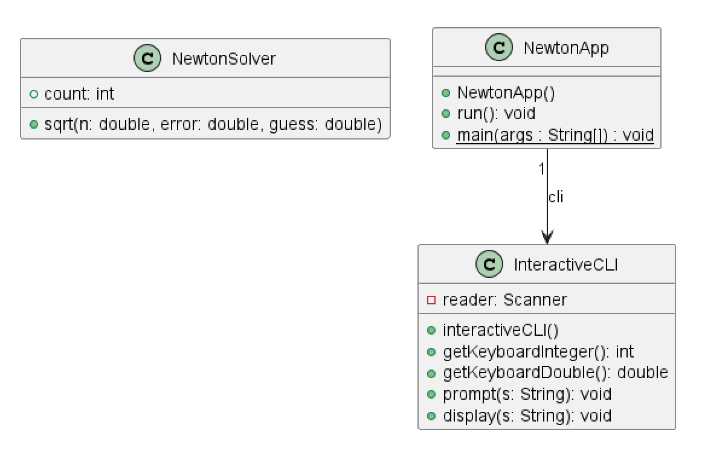
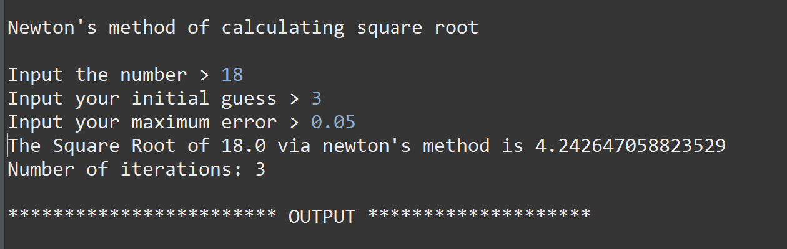
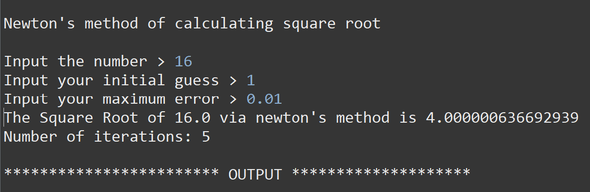
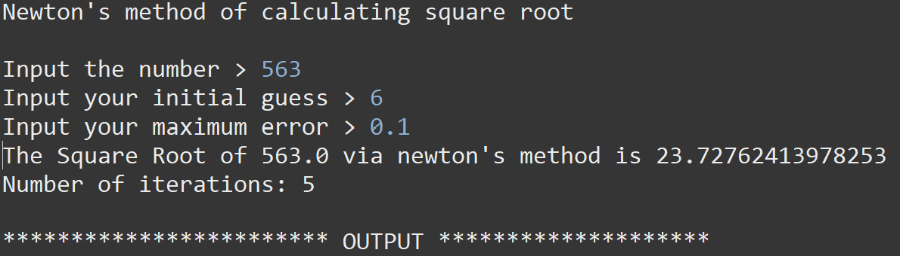

# Newton report
Author: Romil Dhagat 

## UML class diagram

## Execution and Testing
Screenshot demonstrating successful execution and outputs for at least 3 numbers. 

Explain why you chose these numbers for your test.

I chose these numbers to demonstrate the difference between a whole number square root, i.e. 16 vs 18. You can see the difference in the iterations amount coorelating to the initial guess. I wanted to see how many iterations it would take to get to it, and it was interesting that it took the same amount to get to 16 as it did to get to 563.

