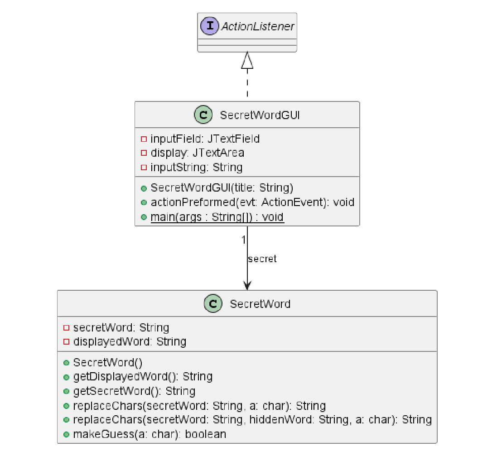
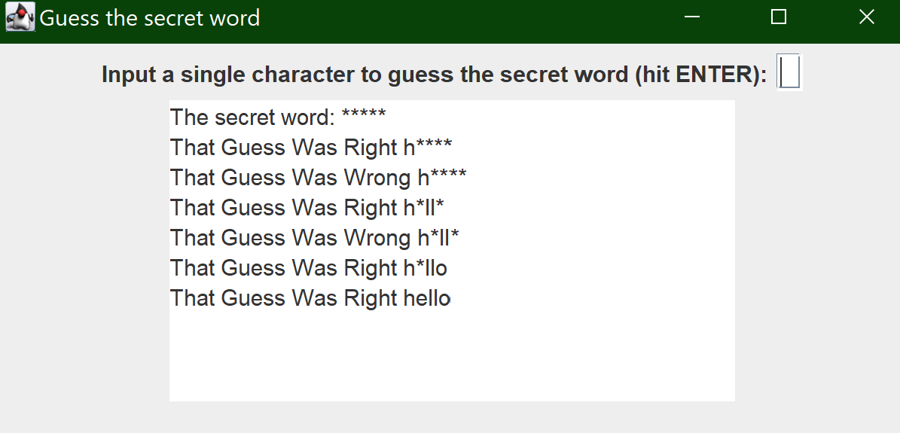

# SecretWord report
Author: Romil Dhagat

## UML class diagram

## Execution and Testing

# Reflection
The Newton solver was interesting because of how the iterations were tracked. The real difficult portion was the secret word, replacing the chars and checking the guess were interesting portions that required a bit of thinking.   