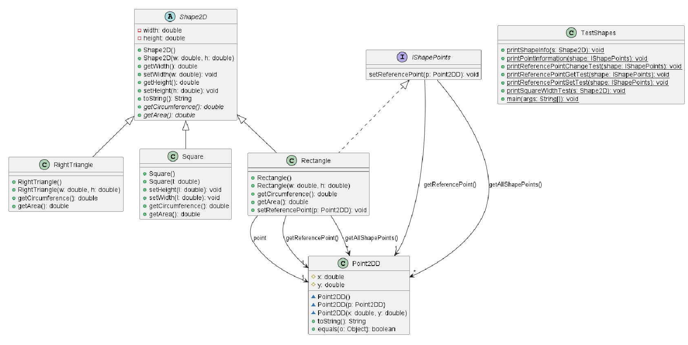
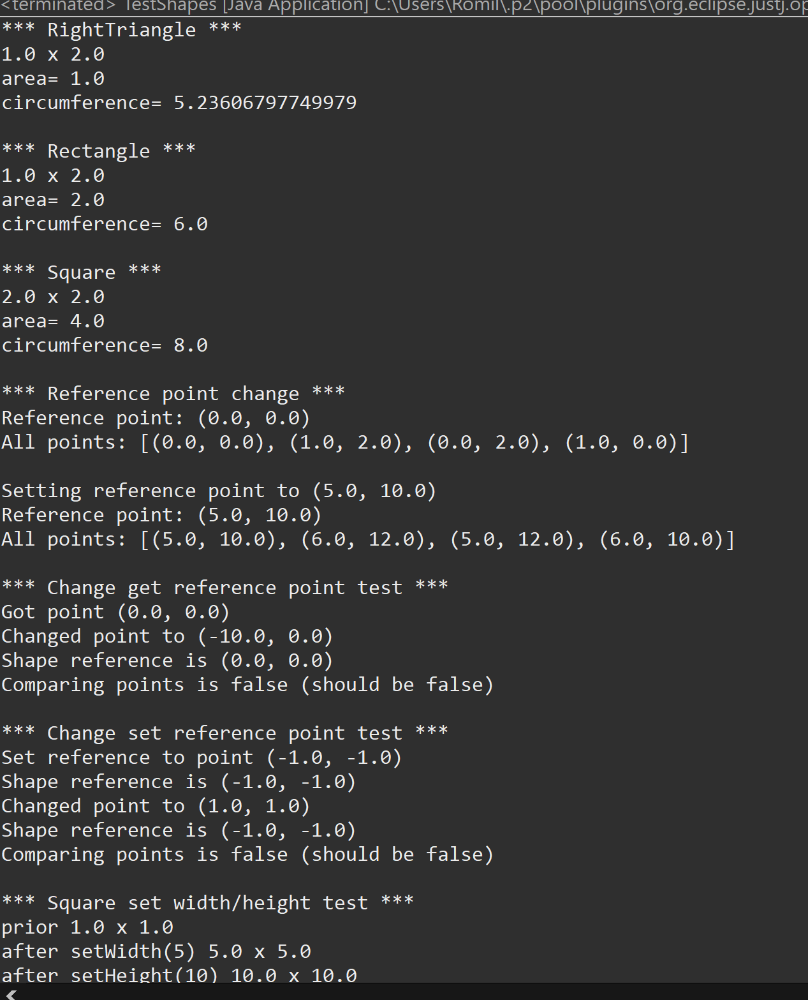

# Shapes report
Author: Romil Dhagat

## UML class diagram
@startuml
class RightTriangle{
	+RightTriangle()
	+RightTriangle(w: double, h: double)
	+getCircumference(): double
	+getArea(): double
}
class Shape2D{
}
Shape2D <|-- RightTriangle
class Square{
	+Square()
	+Square(l: double)
	+setHeight(l: double): void
	+setWidth(l: double): void
	+getCircumference(): double
	+getArea(): double
}
class Shape2D {
}
Shape2D <|-- Square
class Point2DD{
	#x: double
	#y: double
	~Point2DD()
	~Point2DD(p: Point2DD)
	~Point2DD(x: double, y: double)
	+toString(): String
	+equals(o: Object): boolean
}
class Rectangle{
	+Rectangle()
	+Rectangle(w: double, h: double)
	+getCircumference(): double
	+getArea(): double
	+setReferencePoint(p: Point2DD): void
}
class Point2DD {
}
Rectangle --> "1" Point2DD : point
class Point2DD{
}
Rectangle --> "1" Point2DD : getReferencePoint()
class Point2DD{
}
Rectangle --> "*" Point2DD : getAllShapePoints()
class Shape2D{
}
Shape2D <|-- Rectangle
interface IShapePoints{
}
IShapePoints <|.. Rectangle
abstract class Shape2D{
	-width: double
	-height: double
	+Shape2D()
	+Shape2D(w: double, h: double)
	+getWidth(): double
	+setWidth(w: double): void
	+getHeight(): double
	+setHeight(h: double): void
	+toString(): String
	+{abstract} getCircumference(): double
	+{abstract} getArea(): double
}
interface IShapePoints{
	setReferencePoint(p: Point2DD): void
}
class Point2DD{
}
IShapePoints --> "1" Point2DD : getReferencePoint()
class Point2DD{
}
IShapePoints --> "*" Point2DD : getAllShapePoints()
class TestShapes{
	+{static} printShapeInfo(s: Shape2D): void
	+{static} printPointInformation(shape: IShapePoints): void
	+{static} printReferencePointChangeTest(shape: IShapePoints): void
	+{static} printReferencePointGetTest(shape: IShapePoints): void
	+{static} printReferencePointSetTest(shape: IShapePoints): void
	+{static} printSquareWidthTest(s: Shape2D): void
	+{static} main(args: String[]): void
}
@enduml

## Execution and Testing

