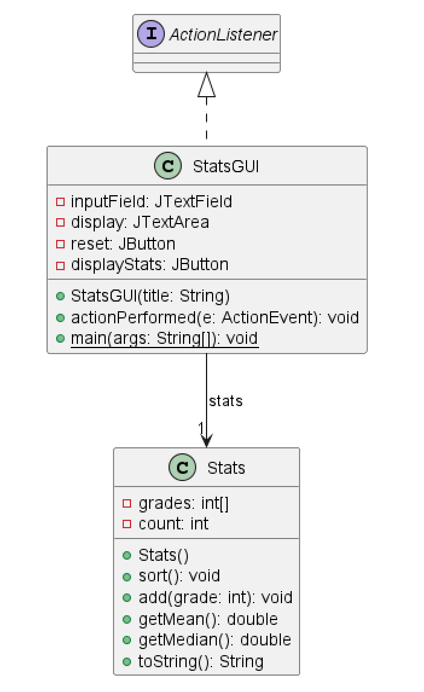
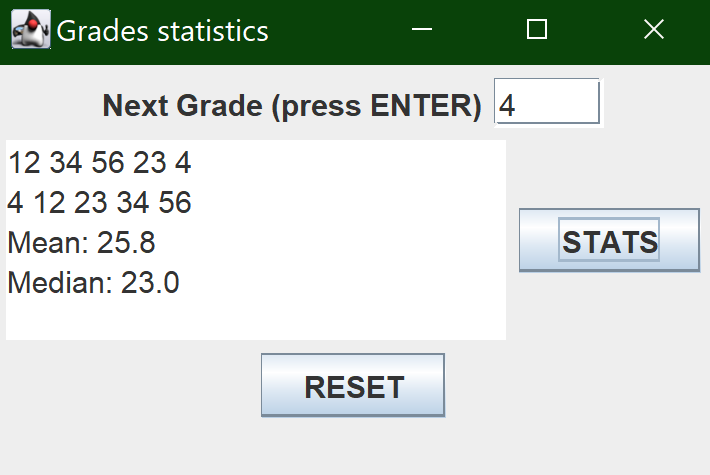

# Stats report
Author: Romil Dhagat

## UML class diagram
@startuml
class Stats{
	-grades: int[]
	-count: int
	+Stats()
	+sort(): void
	+add(grade: int): void
	+getMean(): double
	+getMedian(): double
	+toString(): String
}
class StatsGUI{
	-inputField: JTextField
	-display: JTextArea
	-reset: JButton
	-displayStats: JButton
	+StatsGUI(title: String)
	+actionPerformed(e: ActionEvent): void
	+{static} main(args: String[]): void
}
class Stats{
}
StatsGUI --> "1" Stats : stats
interface ActionListener {
}
ActionListener <|.. StatsGUI
@enduml

## Execution and Testing

# Reflection
This was a good assignment I liked the shapes part more than the stats part of it. The shapes part took some understanding of the inheritance and polymophism. The stats part was run of the mill however seeing the sorting done for me already was nice, I went over it to understand it. 