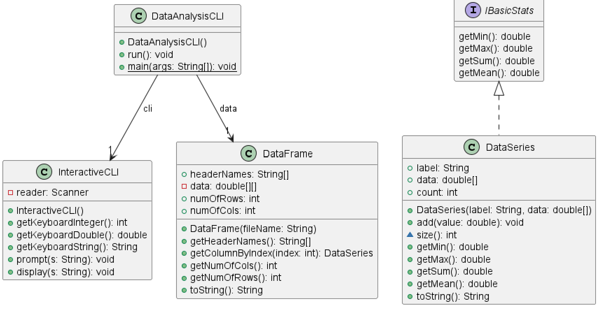
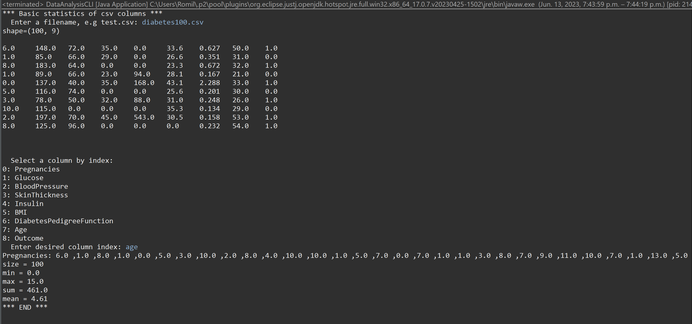
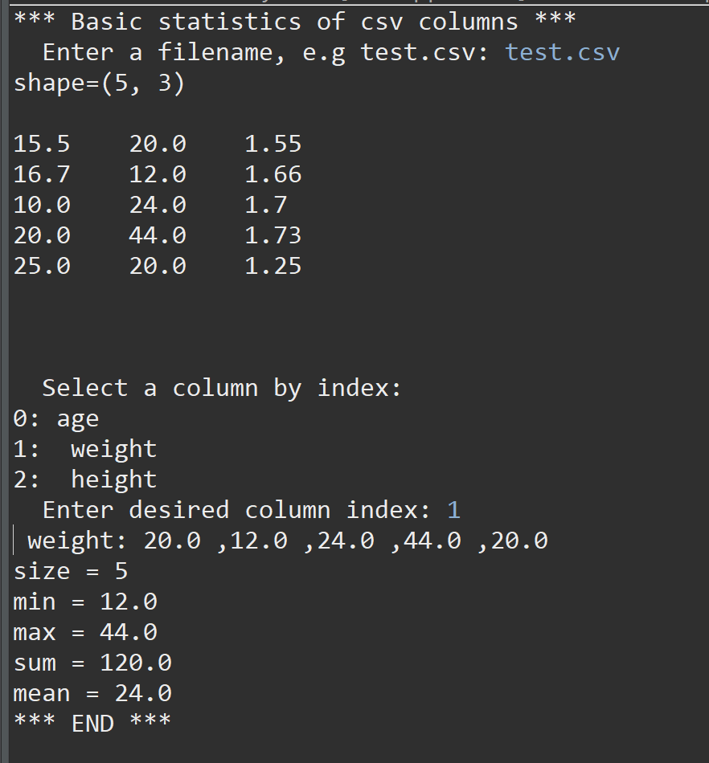
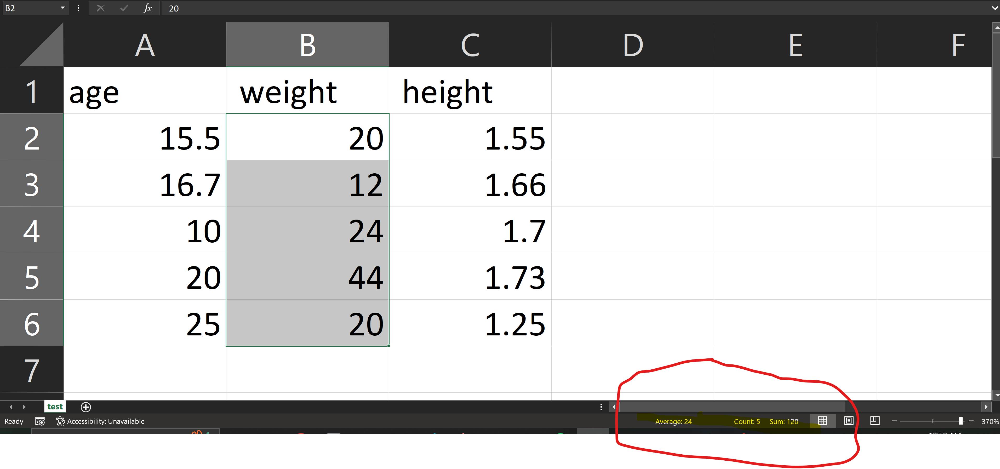

# Data Analysis report
Author: Romil Dhagat

## UML class diagram
@startuml
class InteractiveCLI {
	-reader: Scanner
	+InteractiveCLI()
	+getKeyboardInteger(): int
	+getKeyboardDouble(): double
	+getKeyboardString(): String
	+prompt(s: String): void
	+display(s: String): void
}
class DataSeries {
	+label: String
	+data: double[]
	+count: int
	+DataSeries(label: String, data: double[])
	+add(value: double): void
	~size(): int
	+getMin(): double
	+getMax(): double
	+getSum(): double
	+getMean(): double
	+toString(): String
}
interface IBasicStats {
}
IBasicStats <|.. DataSeries
interface IBasicStats {
	getMin(): double
	getMax(): double
	getSum(): double
	getMean(): double
}
class DataFrame {
}
DataAnalysisCLI --> "1" DataFrame : data
class InteractiveCLI {
}
DataAnalysisCLI --> "1" InteractiveCLI : cli
class DataFrame {
	+headerNames: String[]
	-data: double[][]
	+numOfRows: int
	+numOfCols: int
	+DataFrame(fileName: String)
	+getHeaderNames(): String[]
	+getColumnByIndex(index: int): DataSeries
	+getNumOfCols(): int
	+getNumOfRows(): int
	+toString(): String
}
class DataAnalysisCLI {
	+DataAnalysisCLI()
	+run(): void
	+{static} main(args: String[]): void
}
@enduml

## Execution and Testing

## Verification of statistics

As you can see from the two images above the data is correct and the computations are correct and the same from the both program and the excel.

# Reflection
This was a more challanging assignment as we had to start a lot of this from scratch and I have learned that starting is the hardest part of coding assignments. That is why I follow the readme very closely. The text analysis was a good continuation of what we did in the previous assignment. The data analysis was the part we applied more of the newer stuff we learned, and it related to what we are doing in ENSF 592, therefore it was really interesting.
