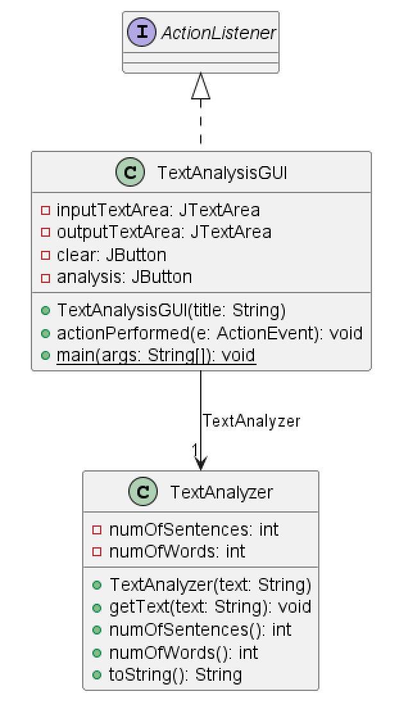
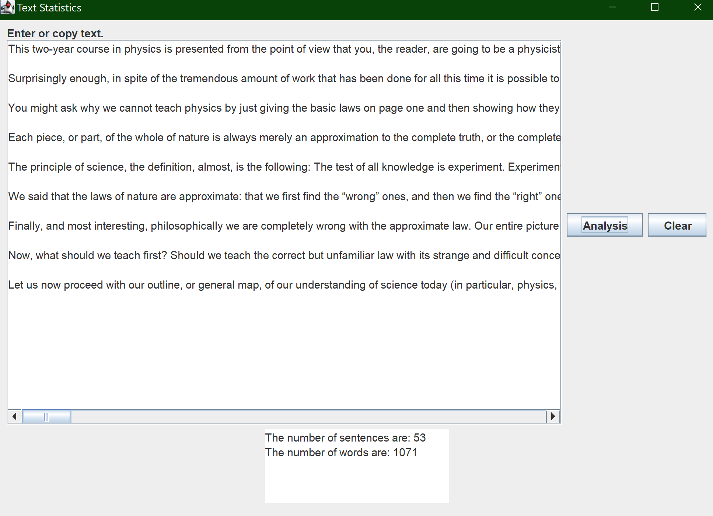

# Text Analysis report
Author: Romil Dhagat

## UML class diagram
@startuml
class TextAnalyzer {
	-numOfSentences: int
	-numOfWords: int
	+TextAnalyzer(text: String)
	+getText(text: String): void
	+numOfSentences(): int
	+numOfWords(): int
	+toString(): String
}

class TextAnalysisGUI {
	-inputTextArea: JTextArea
	-outputTextArea: JTextArea
	-clear: JButton
	-analysis: JButton
	+TextAnalysisGUI(title: String)
	+actionPerformed(e: ActionEvent): void
	+{static} main(args: String[]): void
}
class TextAnalyzer {
}
TextAnalysisGUI --> "1" TextAnalyzer : TextAnalyzer
interface ActionListener {
}
ActionListener <|.. TextAnalysisGUI
@enduml

## Execution and Testing
